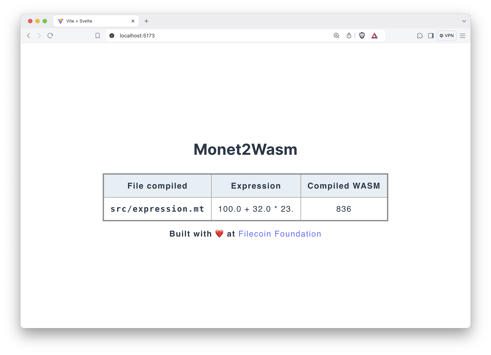

# monetlang

High-level templating language for smart contract creators.

## goals

Flexible domain-specific language (DSL) allowing non-coders to capture and design EVM- and WASM-based smart contracts.

## try monet

Currently work is focusing on Webassembly backend. Here are the steps to try out a proof of concept.

1. Install the command line tool by running `./install` on the terminal. This will place the `monet` script in your local path.

```shell
$ ./install
Installed monet at /usr/local/bin/monet
```

Check if `monet` is available as a command.

```shell
$ which monet
/usr/local/bin/monet
$ monet
Usage:
  compile <monet-file>
  web-server <port>
```

2. Start a local web server that "watches" over the compiled WASM.

```shell
$ monet web-server 9000
```

If port number isn't provided, the server will use the default port `8080`.

3. On the web browser, browse to `localhost:9000` (or change to your preferred port number) and leave it open.

4. Create a monet file that ends with `.monet` or `.mt` and write a simple float number arithmetic, then save it.

Here is an example:

```python
# basic.mt

32. + 40.1 * 3.14
```

There are a few examples in `/examples`.

5. Compile the file.

```shell
> ./monet compile basic.mt
>> "Compiled basic.mt successfully"
```

6. Check the web browser out. The table will display the compiled monet file, compiled expression, and the emitted value in WASM.


